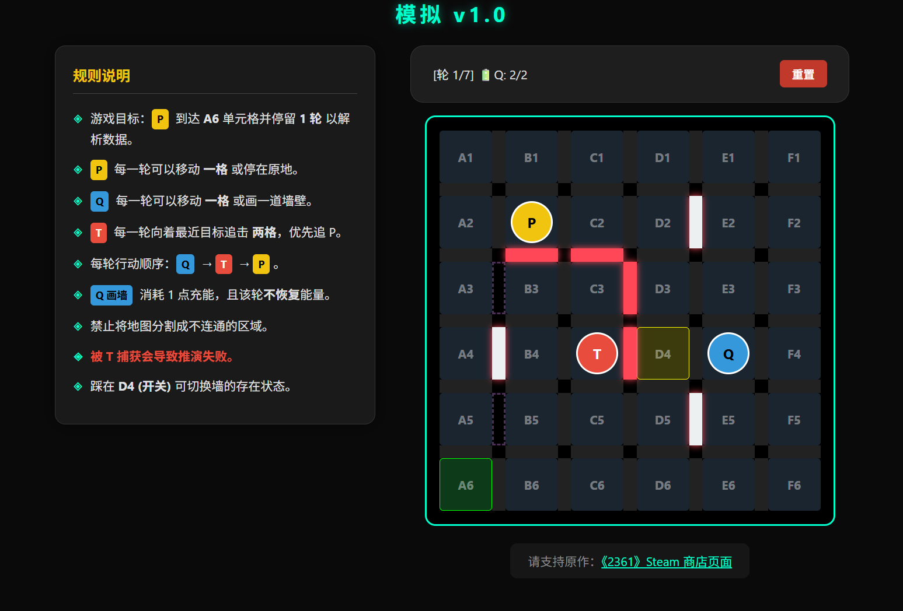

# 一个模拟器 (基于游戏《2361》)

本项目复刻了游戏 **《2361》** 中的某个谜题，旨在提供一个纯净的浏览器端推演环境。

## 项目简介

在本项目中，你将指挥 **P** 与 **Q**，在躲避追踪者 **T** 的同时，前往目标节点完成解析。

## 快速开始

1. 下载项目中的 `index.html`。
2. 使用 Chrome、Edge 或 Firefox 浏览器打开该文件。
3. **操作指南**：
    - 点击相邻格进行**移动规划**。
    - 点击两个格子之间的间隙尝试**画墙**（需 Q 有充能）。
    - 规划完成后，点击上方的 **“执行方案”** 观察回合演变。

## 致谢与声明

本项目为游戏 **《2361》** 谜题的模拟实现。

**请支持原作：**

如果您喜欢这个谜题，请前往 Steam 支持正版作品：
[Steam 商店页面: 《2361》](https://store.steampowered.com/app/4379870/2361/)

---
*本项目仅供学习交流使用。*
